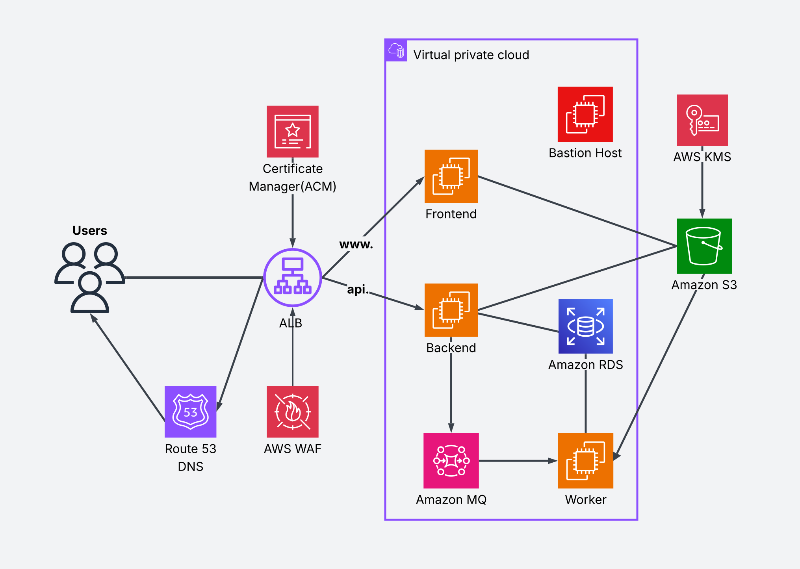

# BetterStart

**BetterStart** is a lightweight **startup management system** designed specifically for small startups.  
It is offered as a **SaaS product** and provides a set of tools to streamline core startup operations.


## ✨ Key Features

### Application Features

1. **Project Management** – Manage projects, tasks, and workflows with ease.  
2. **HR Management with AI-Driven CV Evaluation** – Automate CV screening and improve hiring efficiency.  
3. **Legal GPT** – AI-powered generation of legal documents contextualized for Bangladeshi laws.


### Security Features (14 Total)

| AWS Service      |   Security Features |
|------------------|---------------------|
| **Amazon S3**    | • SSE-KMS Encryption<br>• CORS Policy<br>• Private Buckets with Pre-signed URLs   |
| **VPC**          | • Network ACLs<br>• NAT Gateway<br>• Subnet Segregation                           |
| **EC2**          | • Security Groups<br>• Private Subnet Deployment                                  |
| **AWS WAF**      | • SQLi Prevention<br>• XSS Protection<br>• DDoS Mitigation<br>• Request Throttling|
| **ACM + ALB**    | • HTTPS Enforcement  |
| **Bastion Host** | • IP Whitelisting    |

## 🏗 Architecture

BetterStart is built on a **microservices architecture** for scalability and maintainability.



## 🚀 Deployment

### Cloud Setup (AWS)

**1. Provision Infrastructure with Terraform**
```bash
cd terraform/envs/dev
terraform init
terraform plan
terraform apply --auto-approve
```

This Terraform configuration provisions the complete AWS infrastructure, installs all required runtimes (Python, Node.js, etc.) on each server, and automatically pulls the latest application code from GitHub.

**2. Configure Services**

After infrastructure creation:
1. SSH into the Bastion Host
2. From the Bastion Host, access each private server (frontend, backend, worker)
3. Create and configure `.env` files for each service
4. Start the services on their respective servers

### Infrastructure Components

- **3 EC2 Instances**: Frontend, Backend, and Worker servers (private subnets)
- **Application Load Balancer**: HTTPS-enabled with SSL/TLS termination
- **RDS Database**: Fully managed PostgreSQL instance deployed in a private subnet
- **Amazon MQ**: Managed **RabbitMQ** message broker compatible with existing RabbitMQ-based applications.
- **S3 Bucket**: Private storage with lifecycle policies and encryption
- **Bastion Host**: Secure SSH gateway with IP whitelisting
- **DNS Configuration**: Automated domain setup
- **WAF Rules**: Protection against common web exploits

**Total AWS Services Used**: 10 (S3, VPC, EC2, RDS, Amazon MQ, WAF, ALB, ACM, KMS, Route 53)

---

## 💻 Local Development Setup

**1. Configure Environment Variables**

Navigate to the project root and set up environment files:
```bash
# Copy example env files for each service
cp backend/.env.example backend/.env
cp frontend/.env.example frontend/.env
cp worker/.env.example worker/.env
```

Update the values in each `.env` file with your local configuration.

**Note**: For the backend, create a private S3 bucket and add the bucket name to `backend/.env`.

**2. Start Services with Docker**
```bash
docker compose up --build -d
```

This starts:  
✅ **Backend API**  
✅ **Frontend Web App**  
✅ **RabbitMQ Message Broker**  
✅ **RabbitMQ Worker**

**3. Access the Application**

- **Frontend:** http://localhost:3000  
- **Backend API Docs:** http://localhost:8000/docs  
- **RabbitMQ Management UI:** http://localhost:15672  

---
